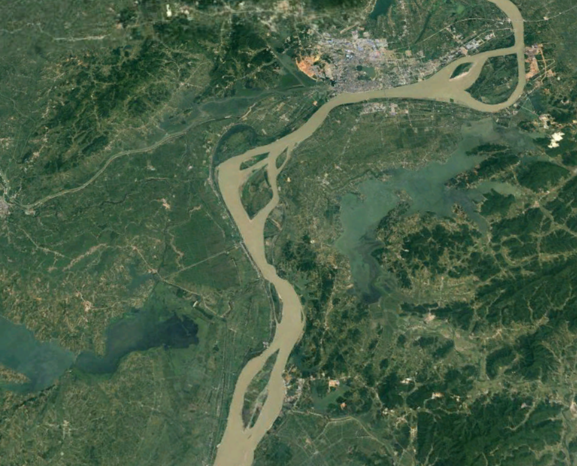
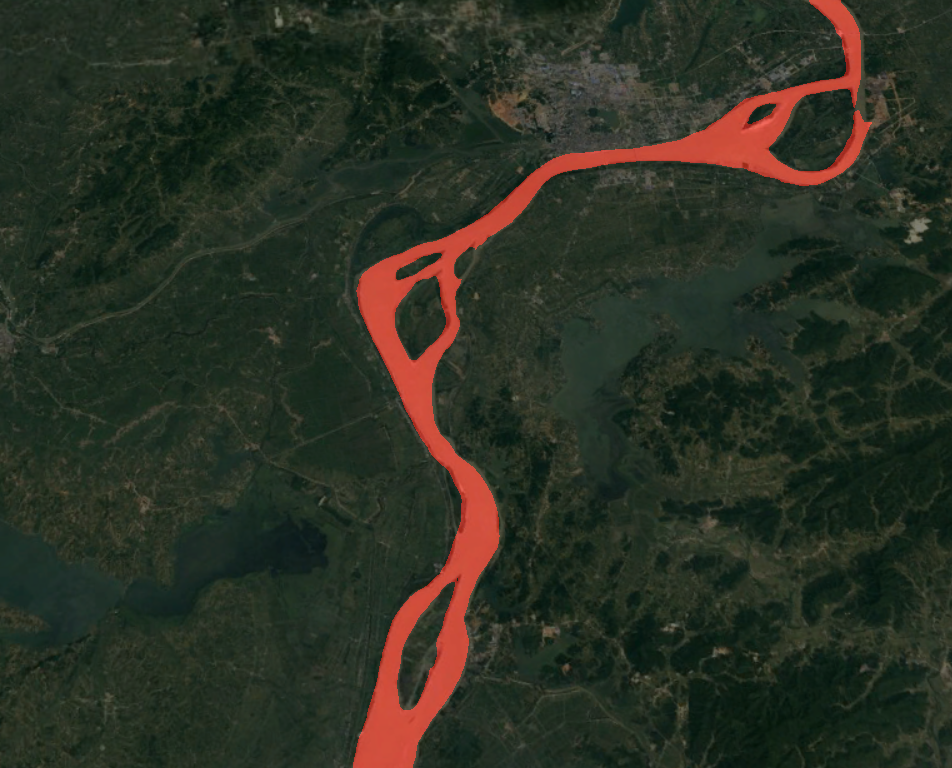
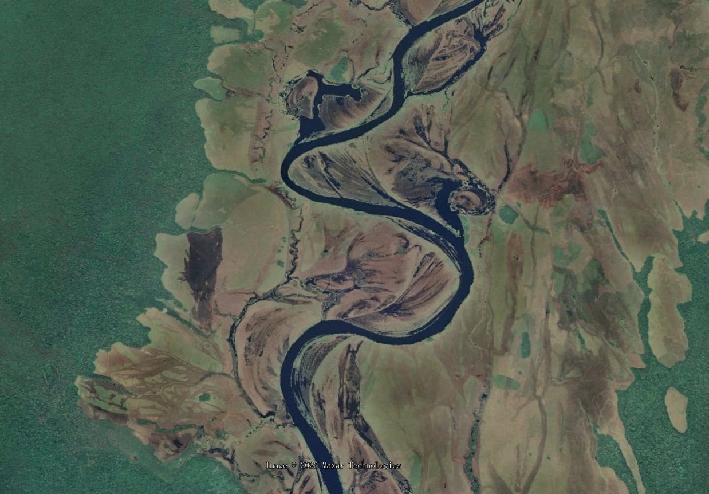
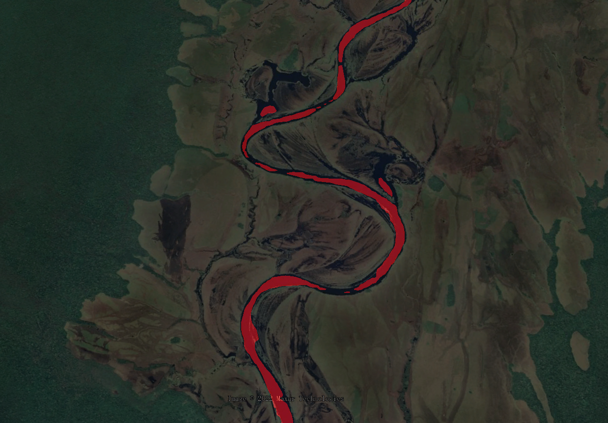
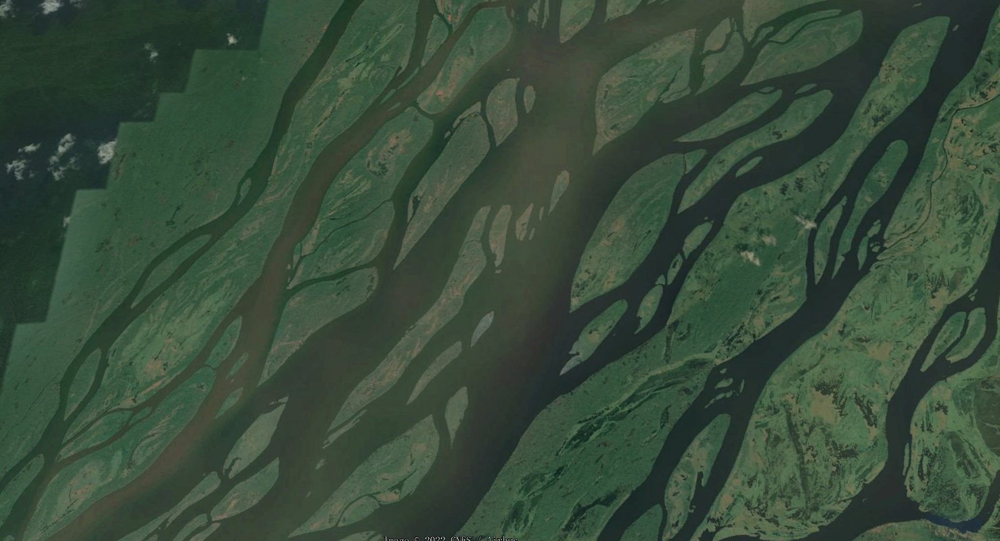
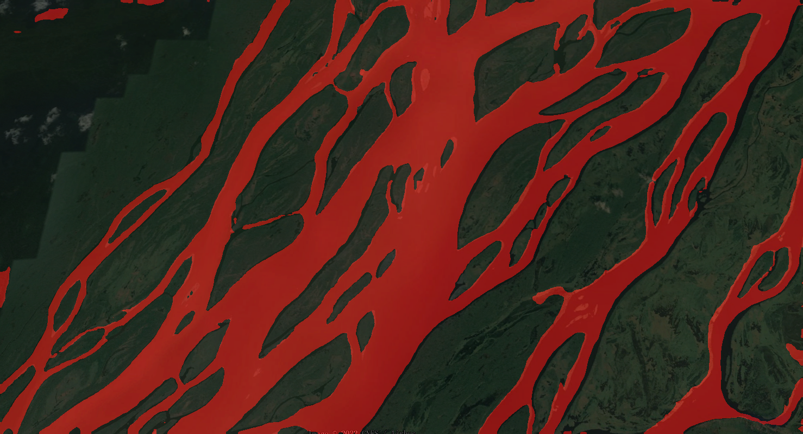

# 大作业：使用Segformer模型分割河流

## 作业运行过程

1. 制作VOC12数据集，数据集主要收集了长江流域的曲流河段和辫状河段。使用Labelme划分河流的边界。
2. 调试Segformer-B0模型的参数，将数据送入模型训练并打分（Laptop-RTX-3060）
3. 得到模型结果，使用mmcv模块和opencv模块编写程序，将得到的模型数据反馈到图片或视频上，也就是将MASK划分出来的范围附着上源图像或视频并输出。


## Pytorch环境

见项目目录下freeze.yml文件，此项目训练完成后部署在了服务器上，所以本环境暂时为纯CPU计算环境。


## 实验结果

训练日志具体见本项目下log文件

训练可视化结果（图像由Google Earth随机截取）

输入图像1：


输出图像1：


输入图像2:


输出图像2：


输入图像3:


输出图像3：



本项目的video_demo.py文件可使用输入24帧的视频输出预测视频

测试视频输入了一个曲流河和一个辫状河的遥感视频，均从谷歌地图随机录取，得到的结果存在videos/下


## 预测


图像预测命令

```shell
python image_demo.py --img screenshot.png --output output.png
```
视频预测,默认输出output.avi,输入暂时支持mkv格式24帧视频。

实际上并不是不支持高于24帧数，而是计算量太大，在单线程预估模型下，60帧视频的合成将过于漫长


```shell
python video_demo.py  sample_01.mkv output.avi segformer.b0.512x512.ade.160k.py latest.pth
```


